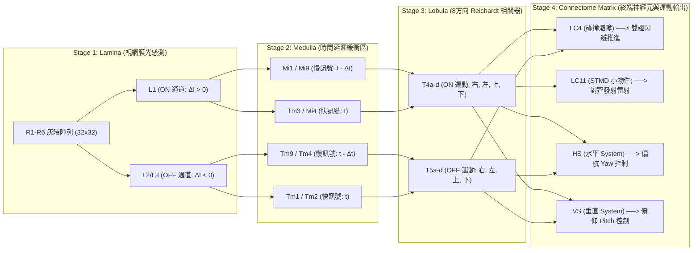

# Drosophila Connectome Neural Simulation & 3D Autonomous Rover
果蠅神經連接組驅動 3D 虛擬自走車立體飛行避障系統 (Drosophila Connectome 3D Rover)

基於美國 Janelia Research Campus 官方 neuPrint 圖譜資料庫 (`male-cns:v1.0`)，整合由上而下 (**Top-Down Reverse Tracing**) 逆向追溯之 4 大核心運動輸出通路（**LC4 避障**, **LC11 小物件追蹤**, **HS 偏航**, **VS 俯仰/翻滾**），利用 **NetworkX** 完成有向子圖合併與 **Mi1 3D 空間錨點** 視網膜矩陣投影，實現從果蠅視葉三段式視覺路徑 (Lamina $\rightarrow$ Medulla $\rightarrow$ Lobula)、8 方向 Reichardt 運動相關器、實時多通道遙測示波器與 **8 種神經元熱圖互動切換**，到 **3D 果蠅虛擬自走車 (Fruit Fly 3D Autonomous Rover)** 雙翅推進與 3D 立體迷宮避障的完整仿生系統。

---

## 📊 目前開發進度 (Current Progress Status)

目前本專案核心模組與 3D 網頁端應用程式已 **100% 完成開發與實測驗證**：

| 模組名稱 | 開發狀態 | 主要功能與實現細節 |
| :--- | :---: | :--- |
| **Module 1: 自動化 Top-Down 矩陣獲取與 Graph Merge** | ✅ 完成 | 支援 neuPrint REST API 與 Cypher 由上而下逆向追溯 (`-[ConnectsTo*3..4]->`)，檢索 **LC4, LC11, HSN/E/S, VS1-6**。使用 **NetworkX** 完成 T4/T5 交疊子圖合併與 **Mi1 3D 空間錨點** 32x32 網膜陣列歸一化投影。持久化儲存 4,000 筆真實突觸數據 (`lc4_connectome_matrix.csv`)。 |
| **Module 2: 三段式視葉路徑與 8 方向 Reichardt 運動感測** | ✅ 完成 | **Stage 1 (Lamina)**: R1-R6 光感測 $\rightarrow$ L1 ON ($\Delta I > 0$) 與 L2/L3 OFF ($\Delta I < 0$) 邊緣分流。<br>**Stage 2 (Medulla)**: 時間延遲緩衝區 (Mi1/Mi9 慢訊號 vs Tm3/Mi4 快訊號, Tm9/Tm4 慢訊號 vs Tm1/Tm2 快訊號)。<br>**Stage 3 (Lobula)**: T4a-d (ON 運動) 與 T5a-d (OFF 運動) 4 方向 Reichardt 相關器。內建高斯平滑與雜訊門檻過濾器。 |
| **Module 3: 多通道神經矩陣計算引擎** | ✅ 完成 | 同時處理 **LC4**, **LC11**, **HS**, **VS** 四大運動通路。實現乙醯膽鹼 (ACh: $+1.0$) 興奮性與 GABA/谷氨酸 (GABA/Glu: $-1.0$) 抑制性極性映射。針對 LC11 (STMD) 進行小目標生物學突觸增益放大。 |
| **Module 4: 實時多通道遙測與拓撲熱圖切換** | ✅ 完成 | 終端機四通道動態進度條與動作電位放電標籤 (`⚡ FIRE!`)。OpenCV 三面板視覺化視窗：支援按鍵 **`1` ~ `9`, `0`, `a`, `g`** 實時切換 R1-6, L1, L2, Mi1, Tm3, T4, T5, **LC4, LC11, HS, VS 視網膜物理拓撲熱圖**，以及 **8-Dir 八方向全覽網格**。 |
| **Module 5: 雙觸角嗅覺趨向迴路** | ✅ 完成 | neuPrint ORN-PN-LHON 嗅覺 Connectome 矩陣 (`olfactory_connectome_matrix.csv`)，實現雙觸角 3D 空間氣味擴散場 (Odor Plume Gradient)、Tropotaxis 差分轉向與 Surge 直奔食物衝刺。 |
| **Web App: 3D 果蠅自走車** | ✅ 完成 | Three.js 3D 果蠅自走車 (`fly_rover.html`)，擬真 3D 果蠅模型與雙翅獨立拍打、左右眼+仰角雷射視角、高對比棋盤地板、**3D 立體迷宮 (3D Labyrinth)**、**懸空過街橋 (Overpass Gate)**、**低牆 (Low Barrier)** 與 **隱形天花板 (Invisible Ceiling Limit)**。 |

---

## 👁️ 三段式視葉視覺處理與 Reichardt 運動模型 (Optic Lobe Circuitry)

本專案精確復刻果蠅視覺神經解剖學路徑：



```text
【Stage 1: Lamina 光感測與邊緣分流】
  R1 - R6 (32x32 灰階) ---> L1 (ON 通道: ΔI > 0 變亮邊緣)
                       ---> L2/L3 (OFF 通道: ΔI < 0 變暗邊緣)

【Stage 2: Medulla 時間延遲緩衝區 (Delay Buffers)】
  L1 ON 通道  ---> Mi1 / Mi9 (慢訊號: t - Δt) vs Tm3 / Mi4 (快訊號: t)
  L2 OFF 通道 ---> Tm9 / Tm4 (慢訊號: t - Δt) vs Tm1 / Tm2 (快訊號: t)

【Stage 3: Lobula 方向選擇性 Reichardt 相關器】
  T4a - d (ON 運動)  : Mi1_slow (空間位移) x Tm3_fast (4 Cardinal Directions: 右, 左, 上, 下)
  T5a - d (OFF 運動) : Tm9_slow (空間位移) x Tm1_fast (4 Cardinal Directions: 右, 左, 上, 下)

【Stage 4: Top-Down Connectome 終端神經元輸出】
  T4 / T5 -> LC4  (ACh: +1.0 Excitatory / GABA: -1.0 Inhibitory) -> Looming Avoidance
  T4      -> LC11 (High Synaptic Gain 8x) -> Small Target STMD Tracking
  T4 / T5 -> HS   (Yaw Optical Flow Differential) -> Yaw Steering Motor Output
  T4 / T5 -> VS   (Pitch Optical Flow Differential) -> Pitch Altitude Motor Output
```

---

## 🎮 實時遙測視窗與多通道拓撲熱圖切換 (Interactive Heatmap Keys)

執行神經模擬器時，在 OpenCV 預覽視窗按鍵盤鍵 **`1` ~ `9`, `0`, `a`, `g`** 可自由切換第二面板的實時熱圖：

| 快捷鍵 | 熱圖名稱 | 生物解剖與工程意義 |
| :---: | :--- | :--- |
| **`1`** | **`R1-R6`** | 原始 32x32 灰階光感測數值 |
| **`2`** | **`L1_ON`** | 亮邊緣提取 ($\Delta I > 0$，變亮) |
| **`3`** | **`L2_OFF`** | 暗邊緣提取 ($\Delta I < 0$，變暗) |
| **`4`** | **`Mi1_slow`** | ON 通道時間延遲緩衝區 (慢訊號，$t-\Delta t$) |
| **`5`** | **`Tm3_fast`** | ON 通道即時訊號 (快訊號，$t$) |
| **`6`** | **`T4_all`** | T4 亮邊緣全方向 Reichardt 運動向量 |
| **`7`** | **`T5_all`** | T5 暗邊緣全方向 Reichardt 運動向量 |
| **`8`** | **`LC4_map`** | **LC4 碰撞避障神經元 Top-Down Retinotopic 視網膜物理拓撲熱圖** |
| **`9`** | **`LC11_map`** | **LC11 小物件追蹤神經元 Top-Down Retinotopic 視網膜物理拓撲熱圖** |
| **`0`** | **`HS_map`** | **HS 水平偏航 (Yaw) 神經元 Top-Down Retinotopic 視網膜物理拓撲熱圖** |
| **`a`** | **`VS_map`** | **VS 垂直俯仰 (Pitch) 神經元 Top-Down Retinotopic 視網膜物理拓撲熱圖** |
| **`g`** | **`8-Dir Grid`** | **$2 \times 4$ 八方向全覽網格** (T4a-d 與 T5a-d 8 個方向運動向量) |

---

## 🌐 GitHub Pages 線上展示應用程式 (GitHub Pages Live Demo Suite)

本專案已將完整 Python 果蠅神經模擬器 (視葉 3 段式視覺路徑 + 多通道 Connectome 突觸矩陣計算 + 12 種視網膜熱圖遙測儀) 100% 移植至 JavaScript，使用者無需安裝任何 Python 或 OpenCV 環境即可透過瀏覽器線上體驗：

🌐 **GitHub Pages 專案 Portal 主頁**：**[https://chihhsiangchien.github.io/maleCNS/](https://chihhsiangchien.github.io/maleCNS/)**

1. 🧠 **神經模擬與視網膜遙測工作台 (`neural_simulation.html`)**：**[https://chihhsiangchien.github.io/maleCNS/neural_simulation.html](https://chihhsiangchien.github.io/maleCNS/neural_simulation.html)**
   - 3 段式視葉 Reichardt 運動模型 (Lamina $\rightarrow$ Medulla $\rightarrow$ Lobula)
   - 多通道 LC4, LC11, HS, VS Connectome 矩陣計算與極性映射 (ACh: $+1.0$, GABA: $-1.0$)
   - 12 種視網膜物理拓撲熱圖動態切換 (按鍵 `1`~`9`, `0`, `a`, `g` 或 UI 按鈕)
   - 4 通道實時動作電位放電示波器 (`⚡ FIRE!`)
   - 支援 WebCam 實體攝影機、標準測試刺激與鼠標互動視角

2. 🪰 **3D 果蠅虛擬自走車避障模擬器 (`fly_rover.html`)**：**[https://chihhsiangchien.github.io/maleCNS/fly_rover.html](https://chihhsiangchien.github.io/maleCNS/fly_rover.html)**
   - Three.js 擬真 3D 果蠅生物模型與雙翅獨立拍打動畫
   - 3D 立體迷宮 (3D Labyrinth)、懸空過街天橋與雙觸角 3D 氣味趨向 (Chemotaxis)

3. 👾 **2D 果蠅大腦 Space Invaders 街機遊戲 (`game.html`)**：**[https://chihhsiangchien.github.io/maleCNS/game.html](https://chihhsiangchien.github.io/maleCNS/game.html)**
   - 果蠅視網膜 32x32 視角感測與演化遺傳演算法 (GA) 自動駕駛 AI

---

### 本地啟動方式

1. 執行本地伺服器：
   ```bash
   python server.py
   # 或 python -m http.server 8000
   ```
2. 在瀏覽器開啟：**[http://localhost:8000](http://localhost:8000)** 或 **[http://localhost:8000/neural_simulation.html](http://localhost:8000/neural_simulation.html)**

---

## 🚀 快速開始 (Quick Start)

### 1. 安裝環境依賴

需求 Python 3.10+，執行以下指令安裝依賴：

```bash
pip install -r requirements.txt
```

### 2. 執行 Python 神經模擬器 (終端機 + OpenCV 視窗)

```bash
# 使用實體 WebCam 攝影機 (鏡頭索引 0)
python main.py --source 0

# 使用標準動態測試刺激模式 (無需攝影機，自動輪播測試刺激)
python main.py --synthetic --stimulus auto
```

### 3. 標準生物學測試刺激模式 (`--stimulus`)

專為驗證各個神經通道所設計的標準測試畫面：

| 參數值 | 誘發神經通道 | 測試視覺動態 |
| :--- | :--- | :--- |
| **`--stimulus stmd_dot`** | **LC11 (小物件追蹤)** | 畫面中央穿過的微細亮點 (觸發高增益 STMD 避開側向抑制) |
| **`--stimulus yaw_sweep`** | **HS (水平 Yaw 偏航)** | 由左至右掃視的垂直光帶 (觸發水平光流) |
| **`--stimulus pitch_sweep`**| **VS (垂直 Pitch 俯仰)**| 由上至下掃視的水平光帶 (觸發垂直光流) |
| **`--stimulus looming`** | **LC4 (碰撞避障)** | 中央急劇擴張的圓形陰影/光斑 (觸發碰撞逃逸) |
| **`--stimulus auto`** | **全通道自動輪播** | 每 50 幀自動輪流切換上述 4 種標準測試刺激 |

### 4. 從 neuPrint 官方資料庫同步最新 Connectome 矩陣

帶入您的 neuPrint API Token 並加上 `--fetch` 參數：

```bash
python main.py --token "您的_NEUPRINT_TOKEN" --fetch --source 0
```

---

## 📁 專案檔案結構 (Project Structure)

```text
maleCNS/
├── index.html              # GitHub Pages 展示 Portal 主頁
├── neural_simulation.html  # HTML5/JS 神經模擬器與視網膜遙測工作台 (Module 1-4 Web 版)
├── fly_rover.html          # 3D 果蠅自走車應用程式 Shell (Three.js 立體避障主頁面)
├── game.html               # 2D 果蠅大腦 Space Invaders 街機遊戲
├── js/
│   ├── optic_lobe_engine.js # Module 2 JS 版: 3 段式視葉路徑與 8 方向 Reichardt 運動相關器
│   ├── neural_matrix_engine.js # Module 3 JS 版: 多通道 (LC4, LC11, HS, VS) Connectome 矩陣極性計算
│   └── neural_telemetry_ui.js # Module 4 JS 版: 12 Mode 熱圖與 4 通道脈衝示波器遙測 UI
├── fly_rover.css           # 3D 自走車與遙測儀賽博朋克玻璃擬物 HUD 樣式
├── fly_model.js            # Three.js 擬真 3D 果蠅生物模型與雙翅獨立拍打動畫
├── rover_brain.js          # 真實 lc4_connectome_matrix.csv 解析與 3D 立體避障神經計算
├── fly_rover.js            # Three.js 3D 賽博競技場、雷射眼陣列、6-DOF 物理與遙測面板
├── connectome_brain.js     # Space Invaders 視網膜 32x32 演化神經大腦
├── game.js                 # Space Invaders 街機遊戲引擎與 GA 訓練
├── connectome_matrix_math.md # 連接組矩陣數學推導、3D 控制理論與神經解剖學完整說明
├── connectome_fetcher.py   # Module 1: Top-Down 逆向 Cypher 檢索、NetworkX 圖合併與 Mi1 3D 錨點投影
├── visual_input.py         # Module 2: Lamina (L1/L2), Medulla (Mi1/Tm3), Lobula (T4/T5 Reichardt 8方向感測)
├── neural_engine.py        # Module 3: 多通道 (LC4, LC11, HS, VS) 極性映射、生性增益與膜電位計算
├── telemetry_visualizer.py # Module 4: 四通道終端進度條與 OpenCV 三面板 (熱圖按鍵 1-8 實時切換)
├── main.py                 # CLI 整合主程式 (帶有 --fetch, --token, --stimulus, --source 等參數)
├── test_simulation.py      # 自動化單元測試套件 (100% 通過)
├── server.py               # 本地 HTTP 伺服器啟動腳本 (Port 8000)
├── lc4_connectome_matrix.csv # 持久化儲存之 4,000 條真實 neuPrint 突觸矩陣
├── README.md               # 專案完整中文說明文件
└── requirements.txt        # Python 依賴套件包
```

---

## 🧪 自動化測試 (Testing)

執行單元測試套件：

```bash
python -m unittest test_simulation.py
```
